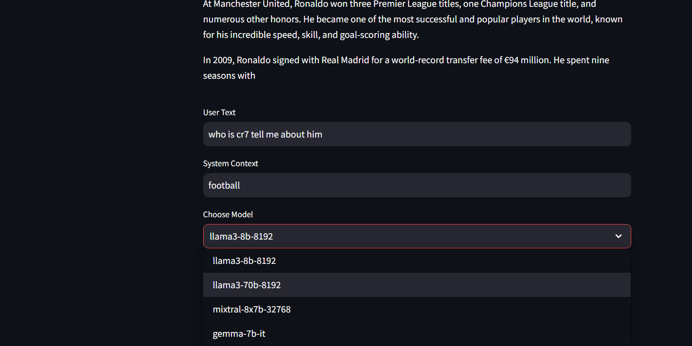

# 🧠 Swarmauri-context-based-chat-bot-hat-bot

## Table of Contents

- [Overview](#overview)
- [Technologies](#technologies)
- [Folder Organization](#folder-organization)
- [Setup](#setup)
- [Notes](#notes)
- [Contributing](#contributing)
- [License](#license)

## Overview: Key Functionalities


# Project Overview

## Objective
Develop a context-based chatbot using the **Swarmauri** library that provides tailored responses based on user-defined contexts and allows model selection.

## Key Features
- **Contextual Interaction**: Users can input specific contexts for relevant responses.
- **Model Selection**: User-friendly interface to select from various LLM models.
- **Frontend**: Interactive UI built with **Streamlit** for real-time conversations.
- **Backend**: Flask server to manage API endpoints for queries and context.
- **Dynamic Responses**: Generates insightful answers based on user input and context.
- **Evaluation**: Continuous performance testing and optimization based on user feedback.

## Integration
- **API Development**: Robust endpoints for external integrations, enabling seamless communication with third-party services.

## Goals
- Enhance user interaction with a context-aware chatbot.
- Provide flexibility in model selection.
- Ensure seamless integration for developers.

## App Preview





# Tools & Libraries Used

1. **Programming Language**: [](https://www.python.org/)
2. **Web Framework**: [](https://flask.palletsprojects.com/) | [](https://streamlit.io/)
3. **Swarmauri Library**: [](https://github.com/your-repo/swarmauri)  <!-- Replace with the actual link if available -->
4. **APIs**: [](https://en.wikipedia.org/wiki/Representational_state_transfer)
5. **Version Control**: [](https://git-scm.com/) | [](https://github.com/)
6. **Continuous Integration (CI)**: [](https://github.com/features/actions)
7. **Environment Management**: [](https://pip.pypa.io/en/stable/) 
## Folder Organization

```

📁.github
└──
    └── 📁workflows
         └── 📃unittests.yml
└── 📜.gitignore
└── 📃app.py
└── 📃llm_model_setup.py
└── 📰README.md
└── 🔋requirements.txt


```


### **Usage**

These modules are designed to be used in conjunction with each other to streamline the data analysis process, from data preparation and cleaning to in-depth analysis and model creation.


  - \***\*init**.py\*\*: Initialization file for the test module.

- **📜.gitignore**: Specifies files and directories to be ignored by Git.

- **📰README.md**: The main documentation for the entire project.

- **🔋requirements.txt**: Lists the Python dependencies required to run the project.

- **📇templates.py**: Contains templates used within the project, possibly for generating or processing data.

## Setup

1. Clone the repo

```bash
git clone https://github.com/Bereket-07/Swarmauri-context-based-chat-bot-hat-bot.git
```

2. Change directory

```bash
cd Swarmauri-context-based-chat-bot-hat-bot
```

3. Install all dependencies

```bash
pip install -r requirements.txt
```

4.  run the Flask app locally.

```bash
python app.py
```

5. run the streamlit app

```bash
streamlit run llm_model_setup.py                          
```

## Contributing

We welcome contributions to this project! To get started, please follow these guidelines:

### How to Contribute

1. **Fork the repository**: Click the "Fork" button at the top right of this page to create your own copy of the repository.
2. **Clone your fork**: Clone the forked repository to your local machine.
   ```bash
   git clone https://github.com/your-username/your-repository.git
   ```
3. **Create a new branch**: Create a new branch for your feature or bugfix.
   ```bash
   git checkout -b feature/your-feature
   ```
4. **Make your changes**: Implement your feature or fix the bug. Ensure your code adheres to the project's coding standards and style.
5. **Commit your changes**: Commit your changes with a descriptive message.
   ```bash
   git add .
   git commit -m 'Add new feature or fix bug'
   ```
6. **Push your branch**: Push your branch to your forked repository.
   ```bash
   git push origin feature/your-feature
   ```
7. **Create a Pull Request**: Go to the repository on GitHub, switch to your branch, and click the `New Pull Request` button. Provide a detailed description of your changes and submit the pull request.

## Additional Information

- **Bug Reports**: If you find a bug, please open an issue in the repository with details about the problem.

- **Feature Requests**: If you have ideas for new features, feel free to open an issue or submit a pull request.

## License

This project is licensed under the MIT License

### Summary

The MIT License is a permissive free software license originating at the Massachusetts Institute of Technology (MIT). It is a simple and easy-to-understand license that places very few restrictions on reuse, making it a popular choice for open source projects.

By using this project, you agree to include the original copyright notice and permission notice in any copies or substantial portions of the software.
